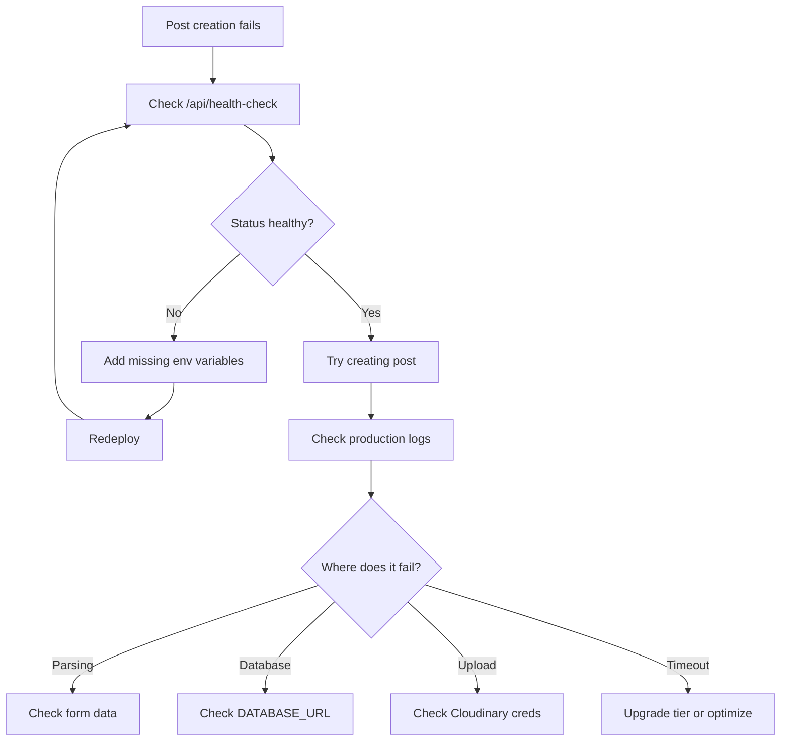

# Why Post Creation Works Locally But Fails in Production

## 🎯 TL;DR - The Answer

**The #1 reason (90% of cases): Missing or incorrect environment variables in production.**

Your local `.env` file is NOT automatically uploaded to production. You must manually add each environment variable to your deployment platform (Vercel/Netlify/etc.).

---

## 🔍 What I've Done to Help You Debug

### 1. Created Debugging Documentation
- **[POST_CREATION_DEBUG_GUIDE.md](POST_CREATION_DEBUG_GUIDE.md)**: Comprehensive troubleshooting guide
- **[ENV_PRODUCTION_CHECKLIST.md](ENV_PRODUCTION_CHECKLIST.md)**: Step-by-step environment setup

### 2. Added Detailed Logging
Updated [app/api/posts/route.ts](app/api/posts/route.ts) with comprehensive logging:
- ✅ Environment variable checks
- ✅ Step-by-step operation logging
- ✅ Detailed error messages
- ✅ File upload progress tracking

Now you'll see in production logs:
```
=== POST /api/posts - Start ===
Environment check: {
  cloudName: "✓ Set" or "✗ Missing",
  apiKey: "✓ Set" or "✗ Missing",
  ...
}
```

### 3. Created Health Check Endpoint
**New endpoint**: `/api/health-check`

Visit `https://yourdomain.com/api/health-check` to instantly see:
- ✅ Which environment variables are set
- ✅ Database connection status
- ✅ Overall system health

---

## 🚀 What You Need to Do Now

### Step 1: Add Environment Variables to Production

Go to your deployment platform and add ALL these variables:

```bash
# CRITICAL for post creation:
NEXT_PUBLIC_CLOUDINARY_CLOUD_NAME="dtan6xot2"
CLOUDINARY_API_KEY="955171912794399"
CLOUDINARY_API_SECRET="qcWuMqE3ON3G3_DtrrJ--Oetlco"

# Plus all others in your .env file
DATABASE_URL="..."
NEXT_PUBLIC_CLERK_PUBLISHABLE_KEY="..."
# etc.
```

**Full list**: See [ENV_PRODUCTION_CHECKLIST.md](ENV_PRODUCTION_CHECKLIST.md)

### Step 2: Redeploy

After adding variables, you MUST trigger a new deployment:
- **Vercel**: Deployments → Redeploy
- **Netlify**: Deploys → Trigger deploy → Clear cache and deploy

### Step 3: Verify Configuration

Visit: `https://yourdomain.com/api/health-check`

Expected result:
```json
{
  "status": "healthy",
  "checks": {
    "cloudinary": {
      "cloudName": true,
      "apiKey": true,
      "apiSecret": true
    },
    "database": {
      "configured": true,
      "connected": true
    }
  }
}
```

If anything shows `false`, that's your problem!

### Step 4: Check Production Logs

After attempting to create a post, check your deployment platform logs:

**Vercel**:
```bash
vercel logs
```

**Netlify**: Check Functions tab

You'll now see detailed output:
```
=== POST /api/posts - Start ===
Environment check: { ... }
1. Parsing form data...
2. Extracted fields: { ... }
3. Creating post in database...
✓ Post created in database: abc123
```

This will tell you EXACTLY where it's failing.

### Step 5: Test Post Creation

1. Go to `/admin` in production
2. Try creating a simple post (without files first)
3. Check browser console for errors
4. Review production logs for detailed output

---

## 🎨 Most Common Issues & Solutions

### Issue 1: Missing Environment Variables ⚠️ MOST COMMON
**Symptoms**:
- "Cloudinary credentials are not found"
- "Failed to create post"
- Health check shows `false` values

**Solution**:
1. Add ALL variables from `.env` to production
2. Redeploy
3. Verify with health check

---

### Issue 2: Timeout (Vercel Free Tier)
**Symptoms**:
- "Function execution timed out"
- Works with small files, fails with large files

**Solution**:
- Upgrade to Vercel Pro ($20/month) for 60s timeout
- OR implement client-side uploads (see debug guide)

**Current config**: 300 seconds (only works on Pro+)

---

### Issue 3: Body Size Limit
**Symptoms**:
- "Request body too large"
- Works locally, fails with files over 4.5MB

**Solution**:
- **Vercel Free**: 4.5 MB limit (upgrade or use client-side uploads)
- **Vercel Pro**: 100 MB limit
- **Netlify**: 6 MB limit

---

### Issue 4: Database Connection
**Symptoms**:
- "Failed to connect to database"
- Health check shows `database.connected: false`

**Solution**:
- Verify `DATABASE_URL` in production
- Check database allows connections from deployment platform
- Consider Prisma Data Proxy for serverless

---

## 📊 Debugging Workflow



---

## 📱 Quick Reference Commands

### View Health Status
```bash
curl https://yourdomain.com/api/health-check | jq
```

### View Production Logs (Vercel)
```bash
vercel logs --follow
```

### Test Database Connection
```bash
npx prisma db pull --preview-feature
```

---

## 🎯 Next Steps

1. ✅ **Read**: [ENV_PRODUCTION_CHECKLIST.md](ENV_PRODUCTION_CHECKLIST.md)
2. ✅ **Add**: All environment variables to production
3. ✅ **Redeploy**: Trigger new deployment
4. ✅ **Verify**: Visit `/api/health-check`
5. ✅ **Test**: Create a post in production
6. ✅ **Debug**: If still failing, check logs and [POST_CREATION_DEBUG_GUIDE.md](POST_CREATION_DEBUG_GUIDE.md)

---

## 💡 Pro Tip

After adding environment variables, always:
1. Clear deployment cache
2. Trigger fresh deployment
3. Wait for deployment to complete
4. Hard refresh your browser (Cmd+Shift+R)
5. Try again

Environment variables are loaded at build time, so you MUST redeploy!

---

## 📞 Still Stuck?

1. Check production logs for the actual error message
2. Visit `/api/health-check` to see configuration status
3. Review the detailed guides:
   - [POST_CREATION_DEBUG_GUIDE.md](POST_CREATION_DEBUG_GUIDE.md)
   - [ENV_PRODUCTION_CHECKLIST.md](ENV_PRODUCTION_CHECKLIST.md)

The enhanced logging will show you exactly what's wrong! 🎯
